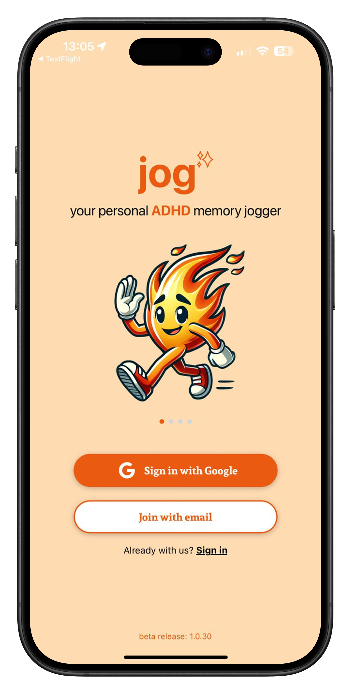
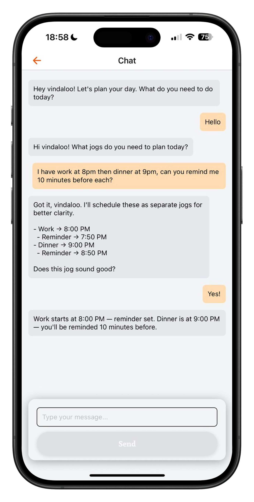
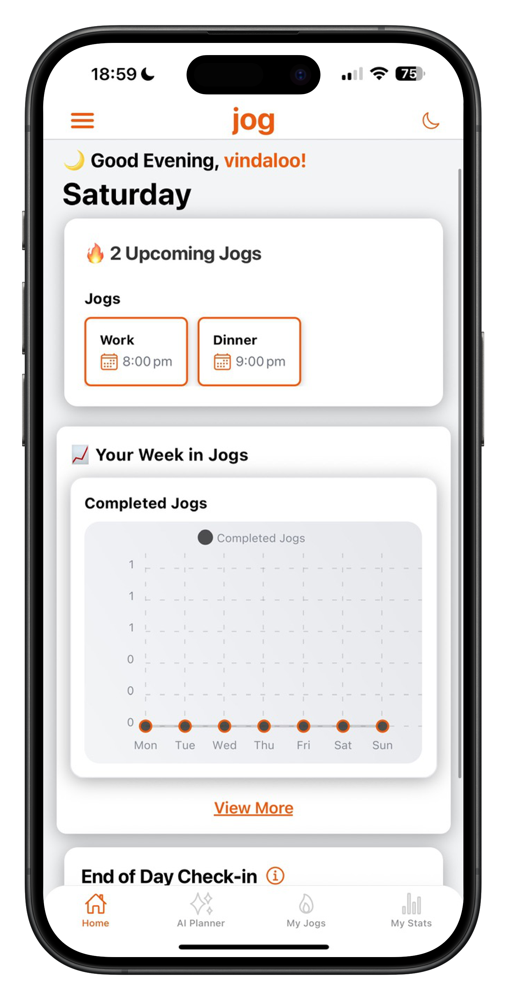
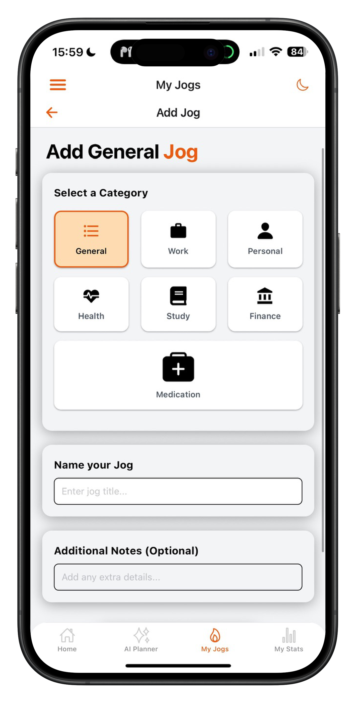
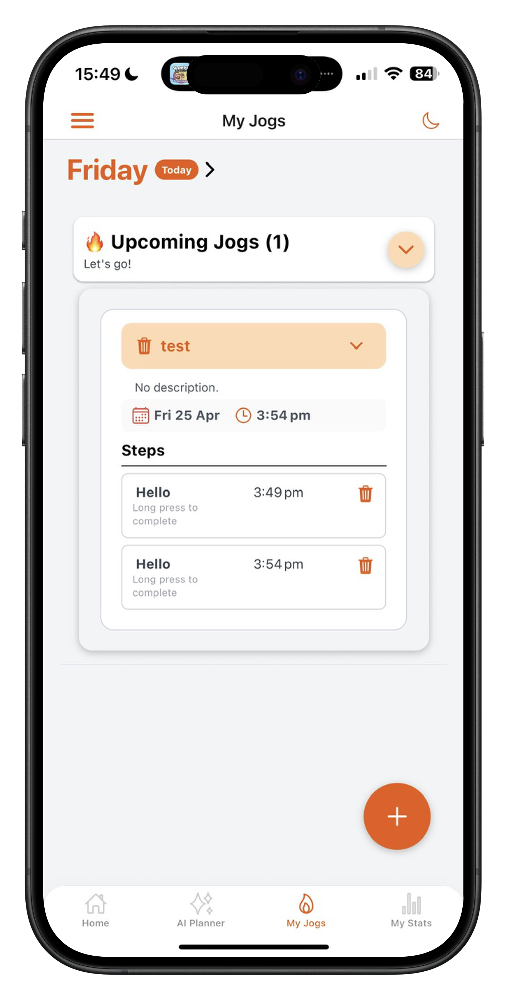
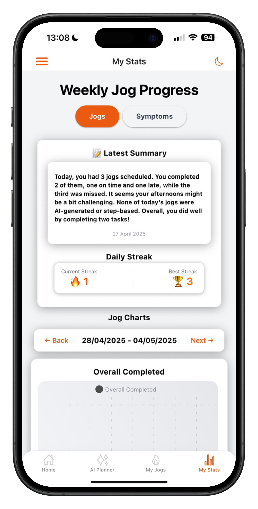
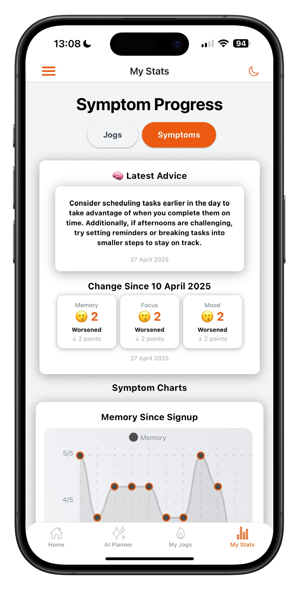
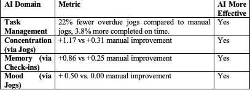

# jog — An ADHD AI-Assisted Self-Help & Symptom Tracking Application (Honours Project)

<div align ="center">
 
</div>


jog is a simple, stylish and user-friendly focussed mobile AI companion that supports adults with ADHD through personalised task planning, symptom tracking with proven cognitive-behavioural therapy principles.

## ✨ Key Features

### AI-Powered Planning
- **Conversational Task Creation**: OpenAI GPT-4o integration for natural language task planning
- **Personalised Daily Structuring**: AI-generated task recommendations based on user patterns
- **Smart Reminders**: Intelligent scheduling based on user behaviour and preferences

<div style="text-align: center; margin: 10px 0;">
    
    
</div>

### Manual Planning & Tracking
- **Custom Task Management**: Manual "jog" (task) creation and organisation
- **Flexible Scheduling**: User-controlled task timing and prioritisation
- **Progress Monitoring**: Real-time task completion tracking
- 
<div style="text-align: center; margin: 10px 0;">
    
    
</div>

### Symptom Management
- **Daily Check-ins**: Reflective symptom assessment sessions
- **Longitudinal Tracking**: Visual progression charts and analytics
- **Cognitive Load Monitoring**: Concentration, memory and mood improvement tracking

<div style="text-align: center; margin: 10px 0;">


</div>


## Tech Stack

### Mobile Development
- **Framework**: React Native with TypeScript
- **Development Platform**: Expo
- **Navigation**: React Navigation
- **UI Components**: Custom ADHD-optimised interface design

### Backend & AI
- **Authentication**: Firebase Authentication (including Google OAuth)
- **Database**: Firestore (NoSQL cloud database)
- **Cloud Functions**: Firebase Cloud Functions
- **AI Integration**: OpenAI GPT-4o API
- **Package Management**: Node.js & NPM ecosystem

### Key Libraries
- `expo-notifications` - Push notification handling
- `react-native-chart-kit` - Data visualisation and progress tracking
- `@react-navigation/native` - Cross-platform navigation
- `firebase` - Backend services integration

##  Architecture

The application follows a **layered architectural design pattern**:

- **Presentation Layer**: React Native components optimised for ADHD user experience
- **Business Logic Layer**: TypeScript services handling task management and AI integration
- **Data Layer**: Firebase Firestore for persistent storage
- **External Services**: OpenAI API for conversational AI functionality
- 
### Methodology:
- **Hybrid Waterfall-Agile approach** with iterative feedback integration
- **Mixed-methods evaluation** combining interaction metrics and questionnaires
- **Real-time updates** via Expo's EAS (Expo Application Services)


## 📋 Prerequisites

- [Node.js](https://nodejs.org/) (version 16 or later)
- [Expo CLI](https://docs.expo.dev/get-started/installation/)
- [React Native development environment](https://reactnative.dev/docs/environment-setup)
- Firebase project with Firestore enabled
- OpenAI API key

## 🚀 Getting Started

### 1. Clone the Repository
```bash
git clone https://github.com/yourusername/jog-app.git
cd jog
```

### 2. Install Dependencies
```bash
npm install
```

### 3. Configure Environment Variables
Create a `.env` file in the root directory:
```env
OPENAI_API_KEY=your-openai-api-key
FIREBASE_API_KEY=your-firebase-api-key
FIREBASE_AUTH_DOMAIN=your-project.firebaseapp.com
FIREBASE_PROJECT_ID=your-project-id
FIREBASE_STORAGE_BUCKET=your-project.appspot.com
FIREBASE_MESSAGING_SENDER_ID=your-sender-id
FIREBASE_APP_ID=your-app-id
```

### 4. Set Up Firebase
1. Create a Firebase project at [Firebase Console](https://console.firebase.google.com/)
2. Enable Firestore Database
3. Enable Authentication (Email/Password and Google)
4. Download and add the configuration file

### 5. Run the Application
```bash
# Start the Expo development server
npx expo start

# Run on iOS simulator
npx expo run:ios

# Run on Android emulator
npx expo run:android
```

## 📱 Usage

### For Users with ADHD:
1. **Register/Login**: Secure authentication with Google OAuth option
2. **AI Chat Planning**: Describe your day to the AI assistant for structured task creation
3. **Manual Task Entry**: Create and organise tasks manually when preferred
4. **Daily Check-ins**: Complete reflective symptom assessments
5. **Progress Tracking**: View longitudinal charts showing improvement over time
6. **Smart Reminders**: Receive contextual notifications based on your patterns

### Key User Flows:
- **AI-Assisted Planning**: Natural conversation > Structured tasks > Automated reminders
- **Manual Planning**: Direct task creation > Custom scheduling > Progress tracking
- **Symptom Monitoring**: Daily check-ins > Data visualisation > Trend analysis

## 🔬 Research & Evaluation

This application was developed as part of academic research into AI-driven digital interventions for ADHD management.

### Study Results:
- **30 participants** engaged over a **month-long trial period**
- **Higher engagement scores** for AI-assisted planning vs. manual methods
- **Reduced cognitive load** particularly in concentration and memory symptoms
- **User preference** showed frequent use of both AI and manual functions
- **AI functions alleviated burden** of manual task entry for many users

<div align = "center">
 
</div>
<br>
Thanks for checking out the project, and most importantly, thank you for every user who participated in the study!

